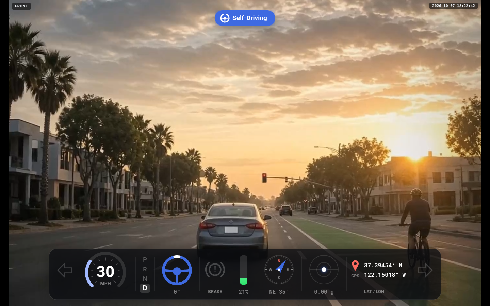
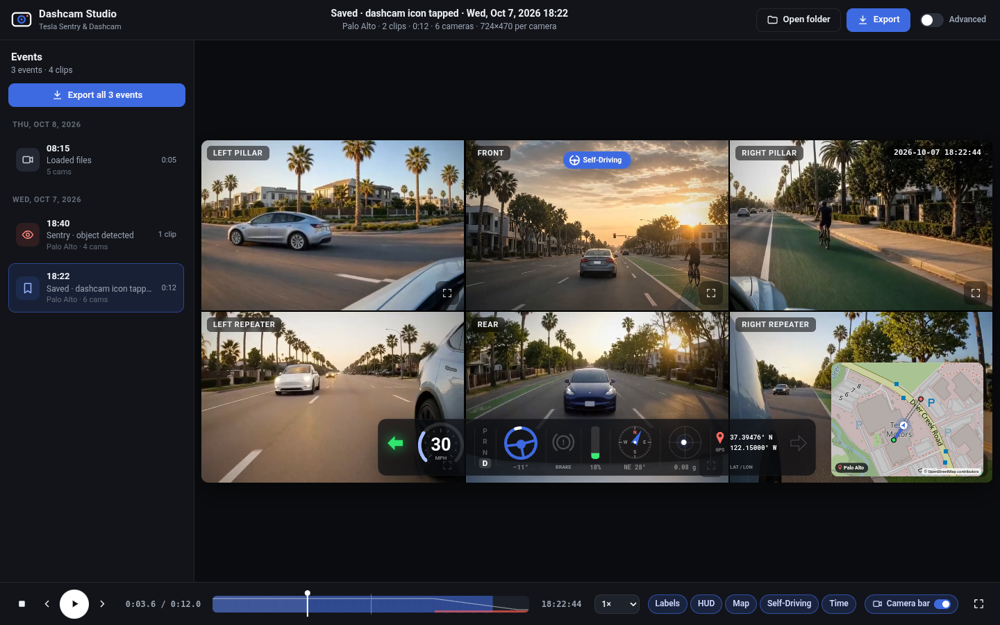
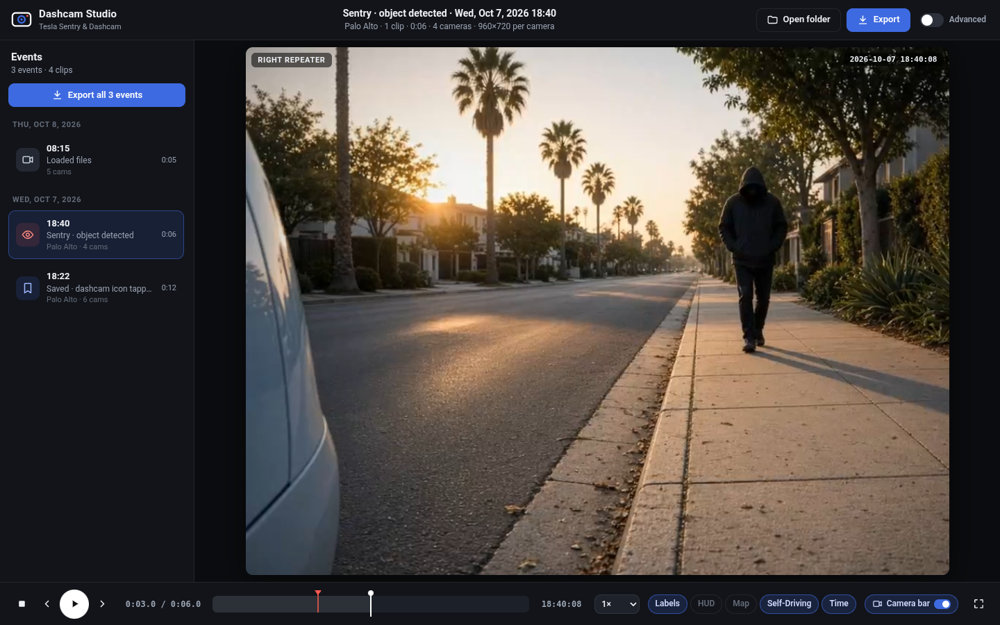
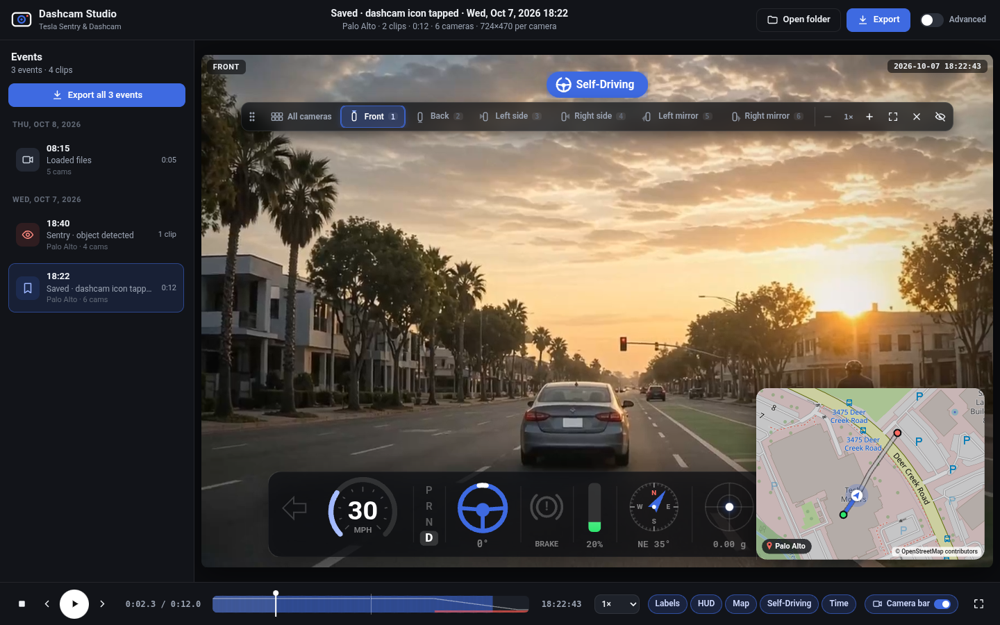
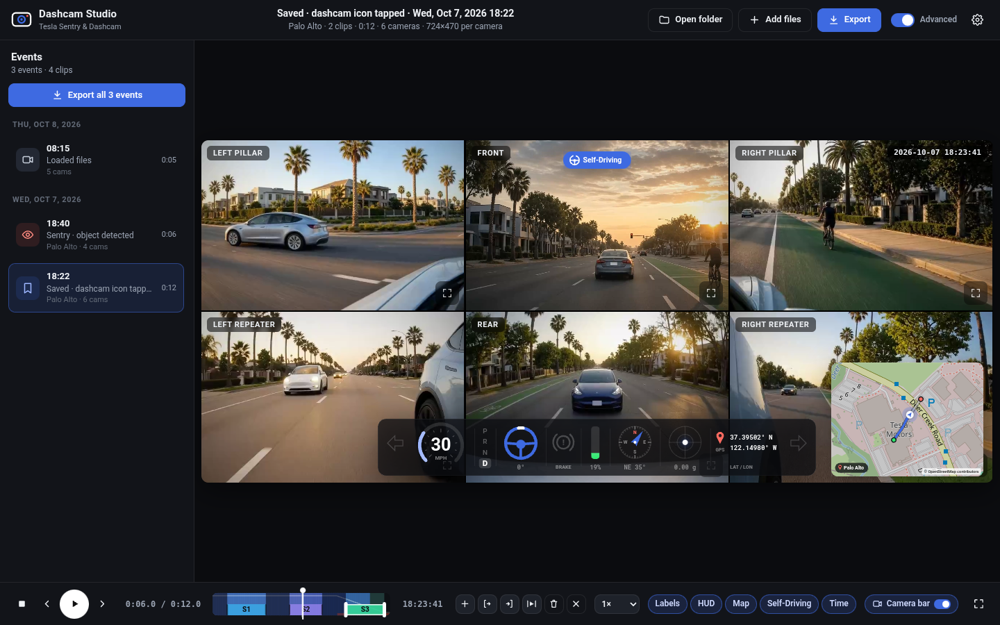
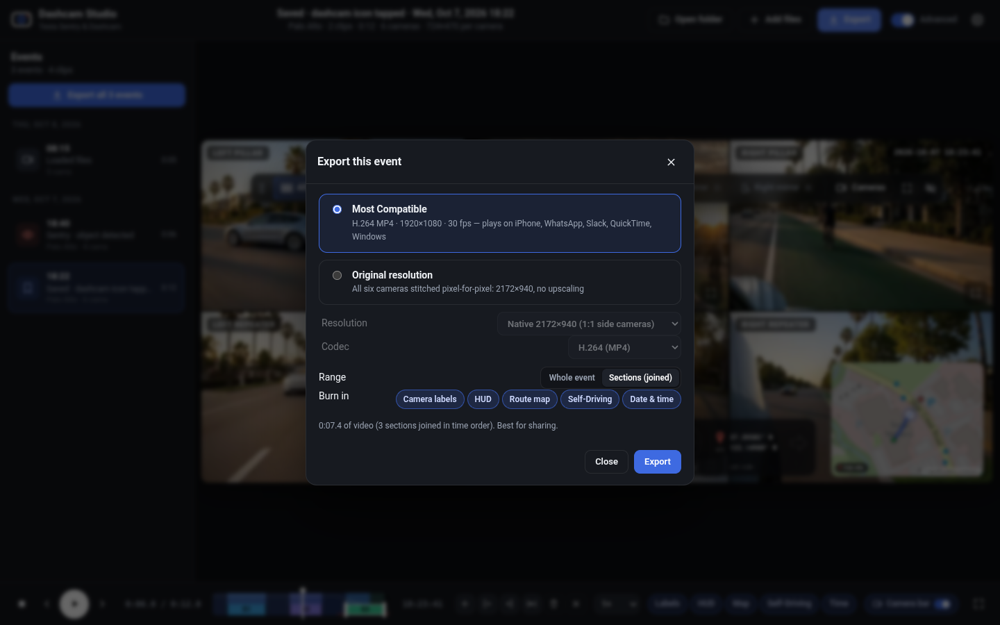
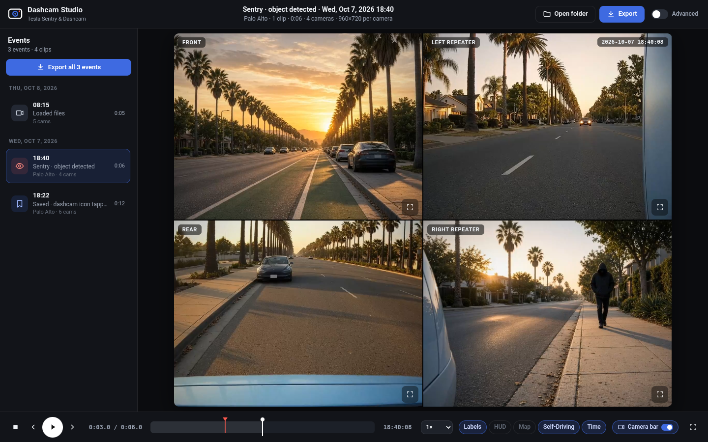
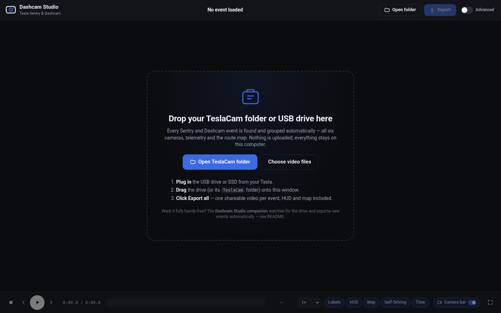
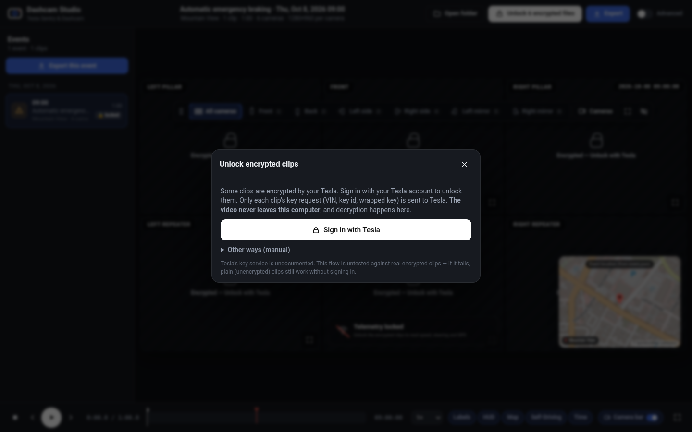

# Tesla Dashcam Studio

### ▶ Use it now: **https://shinrajp.github.io/dashcam-studio/**

A Tesla dashcam and Sentry viewer that runs entirely in your browser. Drop in your TeslaCam folder and get:

- **6-camera grid.** Front, rear, both pillars and both repeaters play in sync in a labelled 3×2 grid, with multi-clip events joined into one timeline.
- **Telemetry HUD.** A draggable graphic HUD with speed, gear, steering wheel, brake, accelerator, blinking turn signals, compass, g-force and GPS. It needs clips with Tesla's embedded telemetry, which arrived in firmware 2025.44.25+ on HW3 and newer.
- **Route map.** A map with the route and a dot that moves with playback. Click the map to seek.
- **Self-Driving badge.** It shows Self-Driving, Autosteer or TACC status.
- **Toggles.** Every overlay can be switched on or off, and your choices are saved.
- **Focus & full screen.** Click or tap any camera to enlarge it, switch angles from the camera bar or with keys 1–6, zoom in up to 4× (pinch, Ctrl+scroll or +/−) and drag to pan. You can also hide cameras in the grid and go full screen. The camera bar can be dragged anywhere on the video (grab ⋮⋮; double-click it to put it back), fades when idle, and can be switched off with the **Camera bar** switch or **C**. A small camera button brings it back.
- **Multi-section trim** (turn on **Advanced**). Mark several sections on the timeline, drag their edges, then play or export them joined into one video. The clock and telemetry stay correct at every cut.
- **Export.** *Most Compatible* gives you a 1080p H.264 MP4. *Original* stitches the grid at native camera resolution, pixel for pixel with no upscaling. Overlays are burned into the video.

More screenshots

Sample footage is AI-generated mock-up imagery: a made-up street, no real dashcam video, people or plates.

## How to use
1. Plug your Tesla USB drive into your computer, or copy its `TeslaCam` folder somewhere.
2. Open the [app](https://shinrajp.github.io/dashcam-studio/). Then either drag the `TeslaCam` folder onto the window or click **Open folder**.
3. Pick an event on the left and press play, or click **Export all** to make one MP4 per event.

## Keyboard shortcuts
| Key | Action |
|---|---|
| Space | play / pause |
| ← → | previous / next frame (Shift: ±5 s) |
| 1 – 6 | focus Front, Back, Left side (pillar), Right side (pillar), Left mirror (repeater), Right mirror (repeater) |
| [ / ] | previous / next camera |
| G or Esc | back to the grid |
| + / − | zoom the focused camera (pinch or Ctrl+scroll also work; drag to pan; double-click resets) |
| F | full screen |
| C | camera bar on / off |
| H · M · D · L | toggle HUD · map · Self-Driving badge · camera labels |

With **Advanced** on: A adds a section, I / O set its start / end, S plays only the sections, Delete removes the selected one.

## Privacy
- **Your footage never leaves your computer.** The video files are read and processed locally in your browser. Nothing is uploaded and there's no server or account.
- **Map tiles** come from OpenStreetMap (`tile.openstreetmap.org`), so OSM sees roughly where the map area is. You can turn map tiles off in the app. The route is then drawn on a plain grid.
- **Encrypted clips:** only small key-request records go to Tesla's own site, and only when you click *Unlock with Tesla* (see below).

## Browser support
- **Chrome or Edge (desktop): best.** You get fast hardware-accelerated export, and *Export all* can save straight into a folder you pick.
- **Safari (Mac):** playback, overlays and trimming work. Export may be slower, and *Export all* saves each video to Downloads one at a time.
- Firefox has not been tested. Phones aren't a target, because they can't read a Tesla USB drive easily.

## Encrypted clips (optional)
Newer Tesla firmware can encrypt dashcam clips. Unencrypted clips need no account at all.

1. Install a userscript manager. On Safari (Mac), use the free **Userscripts** extension from the App Store. On Chrome or Edge, use **Tampermonkey**.
2. Install the connector: open [`connector/Tesla-Grid-Player-Connector.user.js`](connector/Tesla-Grid-Player-Connector.user.js) and click **Raw**. Your userscript manager should offer to install it. The app's unlock dialog also has Download and Copy buttons.
3. In the app, click **Unlock with Tesla** and sign in to your Tesla account in the window that opens. The connector fetches the per-clip keys from Tesla, and decryption happens in your browser.

Some caveats:
- The Tesla key endpoint is undocumented and may change.
- This flow has only been tested against a local mock, not against Tesla's real service.
- The connector only hands keys to this site (`https://shinrajp.github.io`) and to copies of the app running on your own computer (`localhost`).

## Automatic exports (optional companion helper)
The companion runs in the background on your Mac or PC. Plug in the drive and walk away. It finds new Saved and Sentry events, exports a 1080p MP4 of each with the HUD and map burned in, and notifies you when they're done. It only reads the drive and never writes to it.

1. Download this project: [**Download ZIP**](https://github.com/shinrajp/dashcam-studio/archive/refs/heads/main.zip), then unzip it. Keep the folder together, because the helper uses the app files next to it.
2. Install the requirements:
   - **Mac:** install Homebrew from [brew.sh](https://brew.sh), then run `brew install node ffmpeg`. Google Chrome or Microsoft Edge is recommended for the full graphical HUD.
   - **Windows:** run `winget install OpenJS.NodeJS.LTS Gyan.FFmpeg`.
3. Run the installer:
   - **Mac:** double-click `companion/install-mac.command`. If macOS blocks it, run `bash companion/install-mac.command` in Terminal from the unzipped folder.
   - **Windows:** double-click `companion\install-windows.cmd`.
4. Plug in the Tesla drive. The videos appear in `~/Movies/TeslaCam Exports` on a Mac or `Videos\TeslaCam Exports` on Windows.

Helper commands are run as `node companion/dashcam-companion.js <command>`:
- `doctor` checks your setup.
- `config` changes settings, such as native-resolution export, RecentClips, a cloud share folder or auto-decrypt.
- `uninstall` removes the helper.

The [`companion/`](companion/) folder has the source.

## Status
This is a working prototype. It has been tested with synthetic TeslaCam footage in Chrome and on an Apple Silicon Mac, but not yet with a wide range of real Tesla footage, real encrypted clips, or on Windows. Feedback and issues are welcome.

Not affiliated with or endorsed by Tesla, Inc. "Tesla" is a trademark of Tesla, Inc.
